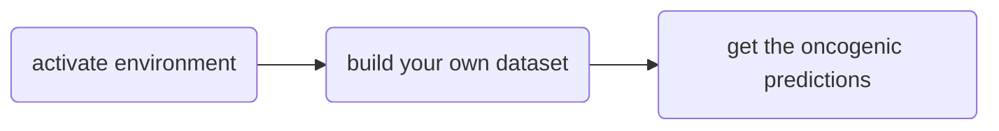

# ChimerDriver
**ChimerDriver** is an automatic tool based on a Multi-Layer-Perceptron (MLP) to assesses the oncogenic potential of gene fusions.
The main contribution consists in the introduction of global information (miRNAs, transcription factors - TF, gene ontologies - GO) to improve the oncogenic prediction task.

## In the following, you will find:

0) **Citation**
1) **Getting Started**: obtain a working copy of ChimerDriver
2) **Usage**: how to use ChimerDriver with examples
3) **Authors' credit**: people contributing to the project
4) **Additional options**: NOT required for running the tool


# 0. Citation
You can find all the theory details about ChimerDriver here: https://www.biorxiv.org/content/10.1101/2021.10.20.465128v1.abstract
If you use the **ChimerDriver** tool, please cite the following:

Lovino, M., Montemurro, M., Barrese, V. S., & Ficarra, E. (2021). _Identifying the oncogenic potential of gene fusions exploiting miRNAs_. bioRxiv.


> @article{lovino2021identifying,
> 
> title={Identifying the oncogenic potential of gene fusions exploiting miRNAs},
> 
> author={Lovino, Marta and Montemurro, Marilisa and Barrese, Venere Sabrina and Ficarra, Elisa},
> 
> journal={bioRxiv},
> 
> year={2021},
> 
> publisher={Cold Spring Harbor Laboratory}}


# 1. Getting Started

ChimerDriver is developed in Python 3.6.12 with minimal libraries required. To run ChimerDriver, we strongly suggest you create a clean virtual environment to avoid conflicts with other projects. If you are an expert with virtual environments, all you need is to install the libraries listed in the requirements files, clone this repository, and jump directly to **Test if everything is ok**. Otherwise, no problem, follow the **Installing** section. The installation is very simple!

## 1.1 Prerequisites

- pandas=1.1.5
- scikit-learn=0.23.2
- keras=2.4.3
- matplotlib=3.3.2
- tensorflow=2.2.0

The complete list of prerequisites is listed in the **requirements.txt** file. 

## 1.2 Installing

First of all, check if you have pip and conda installed in your system. If pip and/or conda are not installed in your system, follow the instructions to install miniconda [here] https://docs.conda.io/en/latest/miniconda.html#installing. If the conda base environment is not yet activated, run this command:
```
conda activate
```
Now copy and paste these instructions to create and activate a ChimerDriver virtual environment called *ChimerDriver* with conda:

```
conda create --name ChimerDriver python=3.6.12  #create a new virtual environment with a selected version of python
conda activate ChimerDriver
```
Then **clone this repository**, unzip _processed_db.zip_ file and install all the required packages listed in the _requirements.txt_ file.  
```
git clone https://github.com/martalovino/ChimerDriver.git
cd ChimerDriver
unzip processed_db.zip
python -m pip install --upgrade pip           # ensure you have the last version of pip
python -m pip install -r requirements.txt
```

## 1.3 Test if everything is ok
Once you have followed the previous steps, test the tool with the following commands:

```
conda activate ChimerDriver # command to activate virtual environment if you followed our installation guide

python ChimerDriver.py build train_test_sets train_test_sets/mytest.csv test N
python ChimerDriver.py load_test_model train_test_sets train_test_sets/mytest.csv train_test_sets/feat_selall.txt best_model.h5
```

If everything worked correctly, you would find the _ChimerDriver_results.csv_ file in the _train_test_sets_ folder after a few seconds.
It is done. You are now ready to use ChimerDriver!


# 2. Usage
Once installed, ChimerDriver usage is really simple. 

First, you need to activate the environment. Then you need to make your own dataset in a suitable format for the tool, using the **build** option. In the end, you can call the **load_test_model** option to get the oncogenic predictions for your gene fusions.



> Before running **load_test_model**, you must call the **build** option on your dataset.

## 2.0 Prepare your data
Copy your dataset in the train_test_sets folder. This file should be a .csv and include the following information as columns:
- FusionPair: The common names of the two genes separated by an underscore, format would be 5pCommonName_3pCommonName
- 5pCommonName: The common name of the gene at the 5' position
- 3pCommonName: The common name of the gene at the 3' position
- Version: either grch37 or grch38
- Chr5p: The 5' chromosome
- Chr3p: The 3' chromosome
- Coord5p: The breakpoint coordinate at the 5' position
- Coord3p: The breakpoint coordinate at the 3' position
- 5pStrand: The 5' gene strand, either "+" or "-"
- 3pStrand: The 3' gene strand, either "+" or "-"

Ideally your dataset should also incluse a "Label" column. If your data is labeled and you intend to assign the same label to the entire dataset there is a functionality that allows this operation (go to section 4.2 to know more about this). On the other hand if the provided dataset is unlabeled the "Label" column can be excluded and the tool will still provide a classification in the output.

## 2.1 Activating the environment
```
conda activate ChimerDriver # command to activate virtual environment if you followed our installation guide
```

## 2.2. Build your own dataset
```
python ChimerDriver.py build train_test_sets train_test_sets/mytest.csv test N
```

## 2.3. Get the oncogenic predictions
```
python ChimerDriver.py load_test_model train_test_sets train_test_sets/mytest.csv train_test_sets/feat_selall.txt best_model.h5
```

# 3. Authors' credit

* **Marta Lovino** - contact marta.lovino@unimore.it
* **Venere Sabrina Barrese** 
* **Marilisa Montemurro** 
* **Elisa Ficarra** - contact elisa.ficarra@unimore.it

# 4. Additional options

## 4.1 Directory structure and files
```
ChimerDriver.py -> main code
ChimerDriver_tools.py -> python module containing all the necessary functions to run the main code
processed_db.zip:
    gene_attribute_matrix.csv -> database containing the transcription factors for each gene
    gene_attribute_matrix_info_biomart.txt -> database containing the gene ontologies for each gene
    miRNA_gene_matrix.csv -> database containing the microRNA probabilities for each gene
    cancermine.csv -> database for the roles of genes, either driver, tumor suppressor, oncogenic or other
fusion_candidates.xlsx -> database of gene fusions published and used by a competitor tool. This set of fusion is not used during testing. Instead it was used during our research to compare the performances with the MLP method.
```

## 4.2 Build the features
The features for the training set and the test set must be constructed using the following four arguments: 
- "build": this command activates the builing mode, the features of the indicated dataset will be created using the databases provided in this repository
- "file.csv": the name of the intended dataset
- "train"/"train_again"/"test" 
   - "train" if the set will serve as a training set, 
   - "train_again" if the dataset will be merged with a previously built train set and both are intended to be used as a training set, 
   - "test" otherwise
- "1"/"0"/"N" 
   - 1 if the label of the entire dataset is positive (e.g oncogenic gene fusion), 
   - 0 if it is negative (e.g non oncogenic gene fusion),
   - N if the "Label" column is already provided in the dataset or if it is not provided
**Important note**: the training set must be built before any of the testing sets. This will reduce the complexity of the algorithm since the building phase of the test sets will exclude any feature that was not build for the training set.
```
Build the training set features -> python ChimerDriver.py build train_test_sets/training_set.csv train N
Build the validation set features -> python ChimerDriver.py build train_test_sets/test_set_1.csv test N
Build the test set features -> python ChimerDriver.py build train_test_sets/test_set.csv test N
```
The files processed with Starfusion were handled accordingly during our research to test the model performances.
As shown below, first the training set was build, the parameter N was given since the Label column is provided in the training dataset.
Then each of the datasets were built separately and the Label 1 was assigned to each of the gene fusions included in this dataset.
```
python ChimerDriver.py build use_case_breast_prostate/training_set.csv train N
python ChimerDriver.py build use_case_breast_prostate/X_SRR064286.csv test 1
python ChimerDriver.py build use_case_breast_prostate/X_SRR064287.csv test 1
python ChimerDriver.py build use_case_breast_prostate/X_SRR064438.csv test 1
python ChimerDriver.py build use_case_breast_prostate/X_SRR064439.csv test 1
python ChimerDriver.py build use_case_breast_prostate/X_SRR064440.csv test 1
python ChimerDriver.py build use_case_breast_prostate/X_SRR064441.csv test 1
python ChimerDriver.py build use_case_breast_prostate/X_SRR496597.csv test 1
python ChimerDriver.py build use_case_breast_prostate/X_SRR496595.csv test 1
python ChimerDriver.py build use_case_breast_prostate/X_SRR496481.csv test 1
```
## 4.3 Cross-validation
To cross validate the model with 10-fold cross validation on the provided training set the command line takes the following arguments:
- "cross_val_model": this command activates the cross validation mode, the tool cross validates the training set with the k-fold method
- "working_folder_name": This is the name of the folder where the datasets are located, the results will be uploaded in this folder
- "trainset.csv" - separated by "+" in case of multiple training sets
- "testset.csv" - separated by "+" in case of multiple testing sets
- "valset.csv" - separated by "+" in case of multiple validation sets
- "num_epochs" - max number of training epochs
- "forest"/"subset"/"subset_forest"/"load" 
   - either use the random forest selection to reduce the number of features, 
   - use a subset of features 
   - or combine the two to obtain a feature set made of the selected databases and reduced by the random forest method. 
   - In alternative an already created feature set can be loaded by specifying the name_feature_set used previously (see next command line argument)
- "5"/"TF"/"GO"/"miRNA"/"5_TF"/"5_miR"/"5_GO"/"TF_miR"/"GO_TF"/"GO_miR"/"5_TF_miR"/"5_GO_miR"/"5_GO_TF"/"5_GO_TF_miR"/"name_feature_set" 
   - pick the features from the transcription factor database (TF), the gene ontologies database (GO), the microRNA database (miRNA), the structural features set (5) or any provided combination of these sets. 
   - When no particular combination of feature sets is needed (i.e. when the previous argument of the command line was either "forest" or "load") any string can be assigned to this argument. The features will be stored in a text file that will be named with the given keyword.
- "forest_thresh" - threshold for the random forest feature selection
- "lr" - learning rate
- "dropout" - dropout value

Train the model on training_set.csv, validate it using the samples in test_set_1.csv. The maximum possible training epochs is 3000, the model uses the random forest selection method on the complete set of features with a threshold of 0.0005. The learning rate is 0.01 and the dropout is 0.2
```
python ChimerDriver.py cross_val_model train_test_sets train_test_sets/training_set.csv train_test_sets/test_set.csv train_test_sets/test_set_1.csv 3000 forest all_feat 0.0005 0.01 0.2
```
Repeat the previous step using the same features but different parameters, for example a dropout value of 0.4.
```
python ChimerDriver.py cross_val_model train_test_sets train_test_sets/training_set.csv train_test_sets/test_set.csv train_test_sets/test_set_1.csv 3000 load all_feat 0.0005 0.01 0.4
```

Train the model on training_set.csv, validate it using the samples in test_set_1.csv. The maximum possible training epochs is 1000, the model uses the transcription factor features only. The learning rate is 0.001 and the dropout is 0.1
```
python ChimerDriver.py cross_val_model train_test_sets train_test_sets/training_set.csv train_test_sets/test_set.csv train_test_sets/test_set_1.csv 1000 subset TF 0.0005 0.001 0.1
```
Train the model on training_set.csv, validate it using the samples in test_set_1.csv. The maximum possible training epochs is 1000, the model uses all the features except for the miRNAs and reduces the number of features with a random forest characterized by a threshold equal to 0.0005. The learning rate is 0.001 and the dropout is 0
```
python ChimerDriver.py cross_val_model train_test_sets train_test_sets/training_set.csv train_test_sets/test_set.csv train_test_sets/test_set_1.csv 1000 subset 5_GO_TF 0.0005 0.001 0
```


## 4.4 Training and Testing
The command line arguments are the same used for the training phase with the exception of the first one which will be "train_test_model" instead of "cross_val_model".

Test the model using the prostate and breast samples provided in the *use_cases_brest_prostate* folder. Train the model on training_set.csv, test it on the samples belonging to the SRR***.csv files listed below. No samples provided to validate the model during training therefore the training will stop after 500 epochs. Each subset of feature is considered and the number of features is reduced with the random forest characterized by a threshold of 0.0005. The learning rate is 0.001 and the dropout is 0.2.
```
python ChimerDriver.py train_test_model use_cases_breast_prostate use_cases_breast_prostate/training_set.csv use_cases_breast_prostate/X_SRR064286.csv+use_cases_breast_prostate/X_SRR064287.csv+use_cases_breast_prostate/X_SRR064438.csv+use_cases_breast_prostate/X_SRR064439.csv+use_cases_breast_prostate/X_SRR064440.csv+use_cases_breast_prostate/X_SRR064441.csv+use_cases_breast_prostate/X_SRR496597.csv+use_cases_breast_prostate/X_SRR496595.csv+use_cases_breast_prostate/X_SRR496481.csv . 500 forest all 0.0005 0.001 0.2
```


## 4.5 Load and Test
To load an existing model and use it to test a dataset the following command line arguments are needed:
-"load_test_model"
-"working_folder_name" - the name of the folder you are working in, this is where the dataset is and the results will be saved in
-"testset.csv"
-"feature_selected_to_load_filename" - the filename of txt file of the feature set used by the model you are testing
-"model_to_load_filename" - the filename of the .h5 file of the model you are testing

```
python ChimerDriver.py load_test_model train_test_sets train_test_sets/test_set.csv train_test_sets/featsel_all.txt train_test_sets/trained_model_lr0.01_nodes_dropout0.2512-256-128-64_actfuncrelu-tanh-relu-tanh.h5

```
Please note that before testing a new dataset it is needed to perform the "build" step on it to obtain the required features in the correct format.

# License

This project is licensed under the AGPL v3 License - see the [LICENSE](LICENSE) file for details

