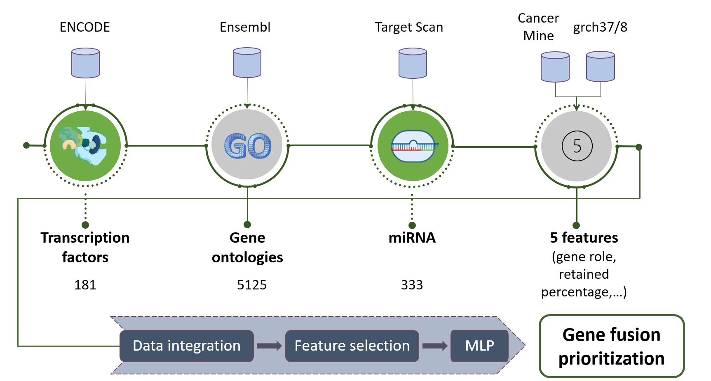
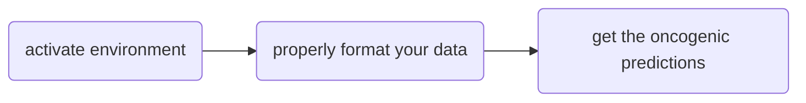

# ChimerDriver
**ChimerDriver** is an automatic tool based on a Multi-Layer-Perceptron (MLP) to assesses the oncogenic potential of gene fusions.
The main contribution consists in the introduction of global information (miRNAs, transcription factors - TF, gene ontologies - GO) to improve the oncogenic prediction task.



**Background** It is estimated that oncogenic gene fusions cause about 20% of human cancer morbidity. Identifying potentially oncogenic gene fusions may improve affected patients’ diagnosis and treatment. Previous approaches to this issue included exploiting specific gene-related information, such as gene function and regulation. Here we propose a model that profits from the previous findings and includes the microRNAs in the oncogenic assessment. We present a classifier called ChimerDriver for the classification of gene fusions as oncogenic or not oncogenic. ChimerDriver is based on a specifically designed neural network and trained on genetic and post-transcriptional information to obtain a reliable classification.

**Results and discussion** The designed neural network integrates information related to transcription factors, gene ontologies, microRNAs and other detailed information related to the functions of the genes involved in the fusion and the gene fusion structure. As a result, the performances on the test set reached 0.83 f1-score and 96% recall. The comparison with state-of-the-art tools returned comparable or higher results. Moreover, ChimerDriver performed well in a real-world case where 21 out of 24 validated gene fusion samples were detected by the gene fusion detection tool Starfusion.

**Conclusions** ChimerDriver integrated transcriptional and post-transcriptional information in an ad-hoc designed neural network to effectively discriminate oncogenic gene fusions from passenger ones.

## In the following, you will find:

0) **Citation**
1) **Getting Started**: obtain a working copy of ChimerDriver
2) **Usage**: how to use ChimerDriver with examples
3) **Authors' credit**: people contributing to the project


# 0. Citation
You can find all the theory details about ChimerDriver here: https://www.sciencedirect.com/science/article/pii/S1532046422000739
If you use the **ChimerDriver** tool, please cite the following:

Lovino, M., Montemurro, M., Barrese, V. S., & Ficarra, E. (2022). Identifying the oncogenic potential of gene fusions exploiting miRNAs. Journal of Biomedical Informatics, 104057.

>@article{lovino2022identifying,  
>  title={Identifying the oncogenic potential of gene fusions exploiting miRNAs},  
>  author={Lovino, Marta and Montemurro, Marilisa and Barrese, Venere S and Ficarra, Elisa},  
>  journal={Journal of Biomedical Informatics},  
>  pages={104057},  
>  year={2022},  
>  publisher={Elsevier}  
>}


# 1. Getting Started

ChimerDriver is developed in Python 3.6.12 with minimal libraries required. To run ChimerDriver, we strongly suggest you create a clean virtual environment to avoid conflicts with other projects. If you are an expert with virtual environments, all you need is to install the libraries listed in the requirements files, clone this repository, and jump directly to **Test if everything is ok**. Otherwise, no problem, follow the **Installing** section. The installation is very simple!

## 1.1 Prerequisites

- pandas=1.1.5
- scikit-learn=0.23.2
- keras=2.4.3
- matplotlib=3.3.2
- tensorflow=2.2.0

The complete list of prerequisites is listed in the **requirements.txt** file. 

## 1.2 Installing

First of all, check if you have pip and conda installed in your system. If pip and/or conda are not installed in your system, follow the instructions to install miniconda [here] https://docs.conda.io/en/latest/miniconda.html#installing. If the conda base environment is not yet activated, run this command:
```
conda activate
```
Now copy and paste these instructions to create and activate a ChimerDriver virtual environment called *ChimerDriver* with conda:

```
conda create --name ChimerDriver python=3.6.12  #create a new virtual environment with a selected version of python
conda activate ChimerDriver
```
Then **clone this repository**, unzip _processed_db.zip_ file and install all the required packages listed in the _requirements.txt_ file.  
```
git clone https://github.com/martalovino/ChimerDriver.git
cd ChimerDriver
unzip processed_db.zip
python -m pip install --upgrade pip           # ensure you have the last version of pip
python -m pip install -r requirements.txt
```

## 1.3 Test if everything is ok
Once you have followed the previous steps, test the tool with the following commands:

```
conda activate ChimerDriver # command to activate virtual environment if you followed our installation guide

python ChimerDriver.py load_test_model train_test_sets train_test_sets/mytest.csv
```

If everything worked correctly, you would find the _ChimerDriver_results.csv_ file in the _train_test_sets_ folder after a few seconds.
It is done. You are now ready to use ChimerDriver!


# 2. Usage
Once installed, ChimerDriver usage is really simple. 

First, you need to activate the environment. Then you need to make your own dataset in a suitable format for the tool (look at  file). Then, you can call the **load_test_model** option to get the oncogenic predictions for your gene fusions.




## 2.0 Prepare your data
Copy your dataset in the train_test_sets folder. This file should be a .csv and include the following information as columns:
- FusionPair: The common names of the two genes separated by an underscore, format would be 5pCommonName_3pCommonName
- 5pCommonName: The common name of the gene at the 5' position
- 3pCommonName: The common name of the gene at the 3' position
- Version: either grch37 or grch38
- Chr5p: The 5' chromosome
- Chr3p: The 3' chromosome
- Coord5p: The breakpoint coordinate at the 5' position
- Coord3p: The breakpoint coordinate at the 3' position
- 5pStrand: The 5' gene strand, either "+" or "-"
- 3pStrand: The 3' gene strand, either "+" or "-"


## 2.1 Activating the environment
To use ChimerDriver it is necessary to activate the newly created environment with the command:
```
conda activate ChimerDriver # command to activate virtual environment if you followed our installation guide
```

## 2.2. Get the oncogenic predictions
You are now ready! Prepare your dataset (take a cue from the  file) and run the following command:
```
python ChimerDriver.py load_test_model train_test_sets train_test_sets/mytest.csv
```
- **train_test_sets**: it is the folder where you want to place the results. If necessary, please include the full or relative path; 
- **train_test_sets/mytest.csv**: it is the file you want to process. If necessary, please include the full or relative path.


Results will be provided in the **ChimerDriver_results.csv_** file in the **train_test_sets** folder.

# 3. Authors' credit

* **Marta Lovino** - contact marta.lovino@unimore.it
* **Venere Sabrina Barrese** 
* **Marilisa Montemurro** 
* **Elisa Ficarra** - contact elisa.ficarra@unimore.it


# License

This project is licensed under the AGPL v3 License - see the [LICENSE](LICENSE) file for details

